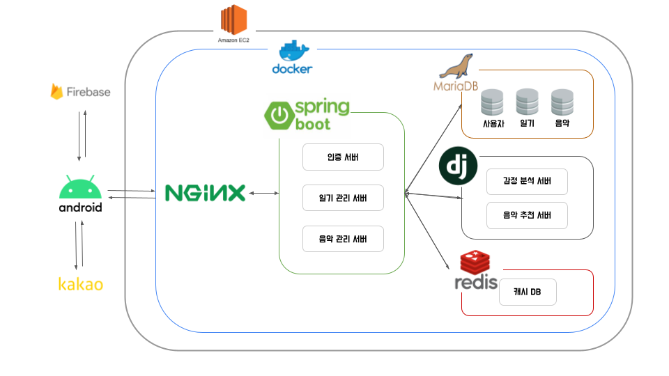

## 🎈 프로젝트 이름 : 마음

## 👨‍👩‍👦‍👦  팀원소개

|NAME|ROLE|EMAIL|
|------|---|---|
|👦전도명|Distribution & Front-End|soulplay95@gmail.com|
|🧑김민기|Back-End|terec@naver.com|
|🧑장진우|NLP & Back-End|zerone0512@gmail.com|
|👦이현송|Recommendation Algorithm|lhs7615@naver.com|


## 📖 프로젝트 소개

마음은 감정분석 및 음악추천 다이어리 입니다. 일기를 쓸때 인공지능으로 자신의 감정을 보여주고 음악을 추천 해 줌 으로써 일기를 쓸때 내 마음도 돌아보고 음악도 추천 받도록 하였습니다. 이외에도 회원들은 안드로이드 앱에서 자신의 캘린더에서 감정도 볼 수 있고 기분에 맞는 음악도 추천 받을 수 있습니다. 이러한 일기 작성 프로그램으로 사용자들이 좀 더 자기만의 마음 흐름과 삶의 리듬을 찾을 수 있게 도와 줍니다. 바쁜일상에서 효율적으로 일기 쓰고 싶은 분들 저희 마음과 함께하세요!


## 🚀 배포 플로우




## 💻 기술 스택

### Frontend

- Android 11 (Red Velvet Cake)
  - 네이티브 앱과 같이 뛰어난 범용성을 제공하는 플렛폼을 구현하고자 Android를 채택하였습니다.
  

### Backend

- Spring-Boot 2.3.9
- MariaDB 10.5.9


### AI

1. **NLP** :
자연어 처리(自然語處理) 또는 자연 언어 처리(自然言語處理)는 인간의 언어 현상을 컴퓨터와 같은 기계를 이용해서 묘사할 수 있도록 연구하고 이를 구현하는 인공지능의 주요 분야 중 하나다. 자연 언어 처리는 연구 대상이 언어 이기 때문에 당연하게도 언어 자체를 연구하는 언어학과 언어 현상의 내적 기재를 탐구하는 언어 인지 과학과 연관이 깊다. 구현을 위해 수학적 통계적 도구를 많이 활용하며 특히 기계학습 도구를 많이 사용하는 대표적인 분야이다. 정보검색, QA 시스템, 문서 자동 분류, 신문기사 클러스터링, 대화형 Agent 등 다양한 응용이 이루어지고 있다.


2. **감정 분석 알고리즘** :
4차 산업혁명이 전 세계에 적용되었고, 최근 5G 서비스가 상용화됨에 따라 초연결 시대가 다가오고 있다. 인터넷은 사람과 사람을 이어주는 소통과 삶의 터전이 되고 있으며, 금융, 보험, 정부 민원 서비스 등 모든 업무 영역이 인터넷으로 처리될 만큼 전송 처리 속도가 빨라짐에 따라 데이터의 축적과 처리량도 늘어나게 되었다. 첨단 정보통신과 멀티미디어의 발전은 사람과 사람을 이어주는 사회 인적 네트워크(Social Network)로 발달됨에 따라 소셜 네트워크는 사용자에게 대화(Conversation) 및 정보(Information)등을 전달하는 효율적인 매개체가 되었다. 초창기 소셜 네트워크는 정보를 전달하는 기능을 장점으로 들 수 있었지만, 오늘날의 소셜 네트워크는 테러계획, 자살계획 등 사회적 부작용이 심각해지고 있어 단점으로 거론되고 있다.
이에 본 연구에서는 오피니언 마이닝 분야 중 감정 분석(Emotion analysis)을 연구 주제로 선정하고 소셜 네트워크를 통해 공유되는 글의 내용을 긍정적 단어(Positive word), 부정적 단어(Negative word)로 구분하고 메시지의 단어들을 점수화한 감정표현단어 사전(Emotion dictionary)을 통해 메시지 속 감정을 연구해보고자 하였다. 본 논문에서는 자연어처리 기술을 통해 분류된 단어들을 데이터베이스 기반 감정표현단어 사전과의 대조작업을 통해 텍스트 감정 점수를 부여하는 방법을 제안하고, 그 결과를 분석하였다.


### Dev-Ops

- AWS EC2 (Ubuntu 18.0.4)
- Jenkins 2.249.2
  - CI/CD 자동화를 통해 개발 생산성을 높이기 위하여 Jenkins를 도입하였습니다.
- Docker 19.03.13
  - 배포에서의 용이성을 위하여 Docker를 도입하였습니다.
  

## 📜 기획

### [WireFrame](https://www.figma.com/file/TCxtH4yewUDNDvMt2XFnZa/%EB%A7%88%EC%9D%8C-%EC%99%80%EC%9D%B4%EC%96%B4-%ED%94%84%EB%A0%88%EC%9E%84)

### [ERD](https://www.erdcloud.com/d/JNCBKA983wkG2D8t7)


## 📱 페이지 기능 소개
### 1. 메인페이지 (to-do list를 추가 수정 삭제 할 수 있도록 도와줌)
### 2. 회원가입 (회원의 정보를 입력하여 db에 추가로 회원을 저장하게 도와줌)
### 3. 셀프스터디 (인공지능을 이용해서 실제 학생이 공부하는 시간과 다른 행동을 하는 시간을 구분해줌)
### 4. 다이어리 (일간, 주간, 월간 으로 나눠서 사람들의 공부시간을 정리 해줌)
### 5. 프로필 (회원의 정보를 보여주고 수정 할 수 있게 도와줌)


## 🔌 Contributing

### [API 명세서](https://www.notion.so/API-8a9f37d221b84a39a954a6b48cc0627c)


## ⭐  Develop Rules
### branch
```
master -> develop -> FEdevelop -> feat/기능이름
master -> develop -> BEdevelop -> feat/기능이름
```

### branch name
```
ex)

BE_register

FE_login
```

### commit 메시지

```
feat : 새로운 기능에 대한 커밋

fix : 버그 수정에 대한 커밋

build : 빌드 관련 파일 수정에 대한 커밋

chore : 그 외 자잘한 수정에 대한 커밋

ci : CI관련 설정 수정에 대한 커밋

docs : 문서 수정에 대한 커밋

style : 코드 스타일 혹은 포맷 등에 관한 커밋

refactor :  코드 리팩토링에 대한 커밋

test : 테스트 코드 수정에 대한 커밋
```
